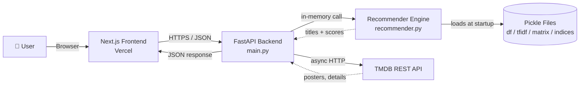
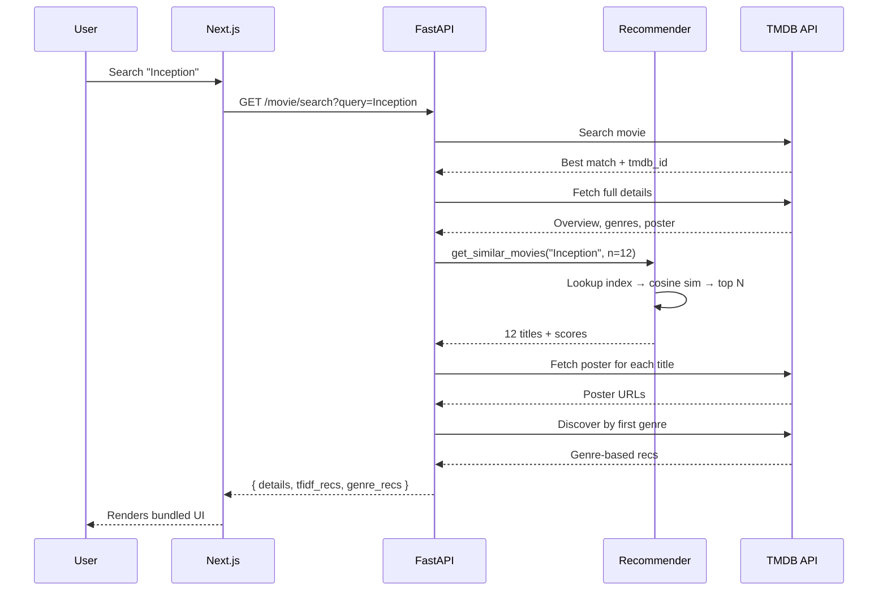

# 🎬 CineMatch

> A full-stack, content-based movie recommender that suggests films two ways — by **similarity to a movie you love** and by **your current mood** — powered by TF-IDF, cosine similarity, and the TMDB API.

<p align="center">
  <a href="https://cine-match-orpin.vercel.app">🌐 Live Demo</a> ·
  <a href="#-api-reference">API Docs</a> ·
  <a href="#-how-it-works">How It Works</a> ·
  <a href="#-roadmap">Roadmap</a>
</p>

<p align="center">
  
  
  
  
  
</p>

---

## 📌 Table of Contents

1. [Overview](#-overview)
2. [Key Features](#-key-features)
3. [Tech Stack](#-tech-stack)
4. [System Architecture](#-system-architecture)
5. [How It Works (ML Concepts)](#-how-it-works)
6. [Project Structure](#-project-structure)
7. [API Reference](#-api-reference)
8. [Example Prompts & Usage](#-example-prompts--usage)
9. [Setup & Installation](#-setup--installation)
10. [Environment Variables](#-environment-variables)
11. [Limitations](#-limitations)
12. [Roadmap](#-roadmap)
13. [Author](#-author)

---

## 🧭 Overview

**CineMatch** is a content-based movie recommendation system that combines classical NLP (TF-IDF + cosine similarity) with a live metadata layer from **The Movie Database (TMDB)** API.

Unlike collaborative-filtering recommenders (which need user-rating data), CineMatch works on **movie content alone** — overviews, genres, cast, keywords — making it cold-start friendly for new users.

There are **two recommendation modes**:

| Mode | Input | Output |
|---|---|---|
| 🎯 **Movie-based** | A movie title (e.g., *Inception*) | Movies with similar themes/content |
| 💭 **Mood-based** | Free-text mood (e.g., *"sad and nostalgic"*) | Movies whose descriptions semantically match |

---

## ✨ Key Features

- 🔍 **Two-mode recommendations** — content-based & mood-based, both running on the same TF-IDF model
- ⚡ **Low-latency inference** — pre-computed TF-IDF matrix loaded once at startup (pickle)
- 🎨 **Live metadata** — posters, ratings, overviews fetched from TMDB on demand
- 🧩 **Bundled API endpoints** — one call returns details + similar movies + genre-based recs
- 🌐 **Production deployment** — FastAPI backend + Next.js frontend on Vercel
- 📜 **Auto-generated OpenAPI docs** at `/docs` (Swagger UI)
- 🔐 **CORS-aware** — configurable origins via env vars

---

## 🛠 Tech Stack

### Backend
- **FastAPI** — async REST API framework
- **Uvicorn** — ASGI server
- **scikit-learn** — `TfidfVectorizer`, `cosine_similarity`
- **pandas / NumPy / SciPy** — data handling & sparse matrix ops
- **httpx** — async HTTP client for TMDB calls
- **Pydantic** — request/response validation
- **python-dotenv** — environment management

### Frontend
- **Next.js** (React) — hosted on **Vercel**

### External APIs
- **TMDB API** — posters, search, details, genre discovery

### ML / Data
- **TF-IDF Vectorizer** for text-to-vector encoding
- **Cosine Similarity** for similarity scoring
- Persisted via **`pickle`** (4 artifacts)

---

## 🏗 System Architecture



### Request Flow — *"Recommend movies similar to Inception"*



---

## 🧠 How It Works

### Step 1 — Build the "soup"
Each movie gets a single text blob combining:
```
overview + genres + keywords + cast + director
```

### Step 2 — TF-IDF Vectorization
Each blob is converted into a numerical vector using **Term Frequency – Inverse Document Frequency**:

$$
\text{tfidf}(t, d) = \text{tf}(t, d) \times \log\!\left(\frac{N}{\text{df}(t)}\right)
$$

| Term | Meaning |
|---|---|
| `tf(t, d)` | How often term *t* appears in movie *d* |
| `df(t)` | Number of movies containing term *t* |
| `N` | Total number of movies |

➡️ Words common in *one* movie but rare *across all* movies get **higher weights** — they're more characteristic.

### Step 3 — Cosine Similarity
To measure how alike two movies are, we compute the **angle** between their vectors:

$$
\cos(\theta) = \frac{\vec{A} \cdot \vec{B}}{\|\vec{A}\| \, \|\vec{B}\|}
$$

| Score | Meaning |
|---|---|
| `1.0` | Identical content |
| `0.0` | Nothing in common |
| `0.3 – 0.6` | Typical "similar movie" range |

> **Why cosine, not Euclidean?** Cosine is **magnitude-independent** — a short overview and a long overview can still match strongly if they're about the same themes.

### Step 4 — Mood-Based Search (the clever trick)
The same `TfidfVectorizer` that encoded the movies is reused to encode the user's mood text:

```python
mood_vector = tfidf.transform(["sad and nostalgic"])
scores = cosine_similarity(mood_vector, tfidf_matrix)
```

Because both the mood string and the movies live in the **same vector space**, we can rank all movies against arbitrary user input — no separate model needed.

### Step 5 — Persistence
Training is expensive; serving must be fast. Four artifacts are pickled:

| File | What's inside |
|---|---|
| `df.pkl` | Cleaned movie DataFrame |
| `tfidf.pkl` | Fitted `TfidfVectorizer` (needed to encode new text) |
| `tfidf_matrix.pkl` | Sparse matrix of all movie vectors |
| `indices.pkl` | `title → row index` lookup map |

These load **once** in FastAPI's `@app.on_event("startup")` — every request after that is a sub-millisecond matrix multiplication.

---

## 📁 Project Structure

```
CineMatch/
├── cinematch/              # Next.js frontend (deployed on Vercel)
├── main.py                 # FastAPI app + all endpoints
├── recommender.py          # TF-IDF similarity engine (2 functions)
├── app.py                  # Optional Streamlit UI
├── movies.ipynb            # Training notebook (data prep + pickling)
├── df.pkl                  # Movie DataFrame
├── tfidf.pkl               # Fitted vectorizer
├── tfidf_matrix.pkl        # Movie vectors (sparse)
├── indices.pkl             # Title → index map
├── requirements.txt        # Python dependencies
├── .gitignore
└── README.md
```

### Core modules

#### `recommender.py` — the ML brain
| Function | Purpose |
|---|---|
| `get_similar_movies(title, n=10)` | Find N movies most similar to a given title |
| `get_recommendations_by_mood(text, n=10)` | Find N movies whose content best matches a free-text mood |

#### `main.py` — the API layer
Wraps the recommender, talks to TMDB, exposes JSON endpoints, and stitches posters onto results.

---

## 📡 API Reference

Base URL (local): `http://localhost:8000` · Interactive docs: `/docs`

| Method | Endpoint | Description |
|---|---|---|
| `GET` | `/health` | Liveness check |
| `GET` | `/home?category=popular` | Home feed (popular / trending / top_rated / upcoming / now_playing) |
| `GET` | `/tmdb/search?query=...` | Search TMDB (typeahead suggestions) |
| `GET` | `/movie/id/{tmdb_id}` | Full movie details by TMDB ID |
| `GET` | `/recommend/genre?tmdb_id=...` | Same-genre recommendations via TMDB Discover |
| `GET` | `/recommend/tfidf?title=...` | Pure TF-IDF recs (no posters) |
| `GET` | `/movie/search?query=...` | **Bundle**: details + TF-IDF recs + genre recs (with posters) |
| `GET` | `/recommend/mood?text=...` | Mood-based recs (with posters) |

### Sample response — `/movie/search?query=Inception`

```json
{
  "query": "Inception",
  "movie_details": {
    "tmdb_id": 27205,
    "title": "Inception",
    "overview": "Cobb, a skilled thief...",
    "release_date": "2010-07-15",
    "poster_url": "https://image.tmdb.org/t/p/w500/...",
    "genres": [{ "id": 28, "name": "Action" }]
  },
  "tfidf_recommendations": [
    {
      "title": "Interstellar",
      "score": 0.4123,
      "tmdb": { "tmdb_id": 157336, "poster_url": "..." }
    }
  ],
  "genre_recommendations": [
    { "tmdb_id": 603, "title": "The Matrix", "poster_url": "..." }
  ]
}
```

---

## 💬 Example Prompts & Usage

### Movie-based
| Try it | Endpoint |
|---|---|
| *"Movies like The Dark Knight"* | `GET /movie/search?query=The Dark Knight` |
| *"Similar to Interstellar"* | `GET /recommend/tfidf?title=Interstellar&top_n=10` |
| *"Action movies in the same vein"* | `GET /recommend/genre?tmdb_id=27205` |

### Mood-based
| Try it | Endpoint |
|---|---|
| *"I'm feeling sad and nostalgic"* | `GET /recommend/mood?text=sad and nostalgic` |
| *"Something dark, mysterious, and cerebral"* | `GET /recommend/mood?text=dark mysterious cerebral` |
| *"Cozy, feel-good, romantic"* | `GET /recommend/mood?text=cozy feel-good romantic` |
| *"Adrenaline, explosions, fast cars"* | `GET /recommend/mood?text=adrenaline explosions fast cars` |
| *"Slow-burn psychological thriller"* | `GET /recommend/mood?text=slow burn psychological thriller` |

---

## ⚙️ Setup & Installation

### Prerequisites
- Python 3.10+
- A free **TMDB API key** → [Get one here](https://www.themoviedb.org/settings/api)
- (Optional) Node.js 18+ if you also want to run the Next.js frontend

### 1. Clone

```bash
git clone https://github.com/taniishq13/CineMatch.git
cd CineMatch
```

### 2. Backend setup

```bash
python -m venv venv
source venv/bin/activate          # Windows: venv\Scripts\activate
pip install -r requirements.txt
```

### 3. Add your environment file

Create a `.env` file in the project root (see [Environment Variables](#-environment-variables)).

### 4. Run the API

```bash
uvicorn main:app --reload --port 8000
```

Open [http://localhost:8000/docs](http://localhost:8000/docs) for the Swagger UI.

### 5. (Optional) Run the Streamlit demo

```bash
streamlit run app.py
```

### 6. (Optional) Run the Next.js frontend

```bash
cd cinematch
npm install
npm run dev
```

---

## 🔐 Environment Variables

Create a `.env` file at the project root:

```env
# Required
TMDB_API_KEY=your_tmdb_api_key_here

# Optional — comma-separated list of allowed origins for CORS
CORS_ORIGINS=http://localhost:3000,https://cine-match-orpin.vercel.app

# Optional — regex for previews (e.g., Vercel preview deployments)
CORS_ORIGIN_REGEX=^https://.*\.vercel\.app$

# Optional — server port (default: 8000)
PORT=8000
```

---

## ⚠️ Limitations

- 🎯 **No personalization** — same input always produces the same output (no user history).
- 🤝 **Content-based only** — can't capture *"people who liked X also liked Y"* patterns.
- ❄️ **Item cold-start** — a new movie without an overview can't be ranked.
- 📚 **Lexical, not semantic** — *"happy"* and *"joyful"* are treated as unrelated tokens. *(SBERT/OpenAI embeddings would fix this.)*
- 🔡 **English-only** — vectorizer was trained on English text.

---

## 🚀 Roadmap

- [ ] 🧠 Replace TF-IDF with **sentence embeddings** (SBERT / OpenAI / Cohere) for semantic matching
- [ ] 🗂 Move vectors to a **vector DB** (FAISS / Qdrant / Pinecone) for sub-linear search
- [ ] 🤖 Add an **LLM agent** that re-ranks candidates based on natural-language requests *("like Inception but funnier")*
- [ ] 👤 **User accounts** — auth, watchlists, history, personalization
- [ ] 🎮 **Interactive features** — quizzes, leaderboards, "swipe-to-like", shareable watchlists(like spotify)
- [ ] 🤝 **Hybrid recommender** — combine content-based with collaborative filtering once user data exists
---

## 👤 Author

**Tanishq Kumar Sarawagi**
B.Tech AI & ML · Newton School of Technology

---

<p align="center">
  <i>Built with ☕, scikit-learn, and an unhealthy obsession with finding the perfect movie for the moment.</i>
</p>
